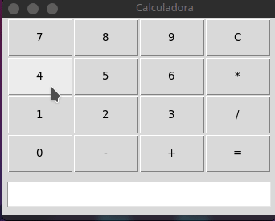

# Projeto Calculadora Simples

Apesar de simples neste código consigo mostrar muitas habilidades adquiridas durante meu curso de python.  
Grande destaque do código a função que desenha a calculadora na tela:  
```python
def createCalc(self):
        self.result = tk.Entry(self.master,width=36)
        self.result.grid(row=1,column=0,padx=5,pady=10,ipady=5)    
        bottons = [
                   "7","8","9","C",
                   "4","5","6","*",
                   "1","2","3","/",
                   "0","-","+","="
                   ]
        i, j = 1, 1
        for btn in bottons:
            pressButton = lambda x=btn:self.calculator(x)
            self.btnCalc = tk.Button(self,text=btn,width=6,height=2,command=pressButton)
            self.btnCalc.grid(row=i,column=j)
            if j >= 4:   
                i+=1
                j=0                        
            j+=1
```
 
Vídeos de demonstração:  



