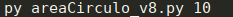

# Project calculate circle area  

Esse é um exercício que faz o calculo da área do círculo.  

Foi desenvolvido de acordo com o progresso do curso ate chegar na sua ultima versão a __v8__ onde esta completo.  

Um exercício simples porém na versão final alguns conceitos como:
1. Class -> Usado para definir a cor do texto quando a execução apresenta algum erro.  
2. Função Circulo -> criada para fazer o calculo da área do circulo.  
3. Função Help -> criada para mostrar mensagens de ajuda na tela.  

This is an exercise that calculates the area od the circle.

It was developed according to the progress of the course until reaching its final version at __v8__ where it is complete.

A simple exercise but in the final version some concepts like:
1. Class -> Used to define the color of the text when the execution has an error.
2. Circle function -> created to calculate the area of the circle.
3. Help -> function created to show help messages on the screen.

Para executar coretamente / To perform correctly:
```
python areaCirculo.py <raio>
```
__< raio >__ -> precisa passar o raio como um argumento para executar. / need to pass the beam as an argument to execute. 



