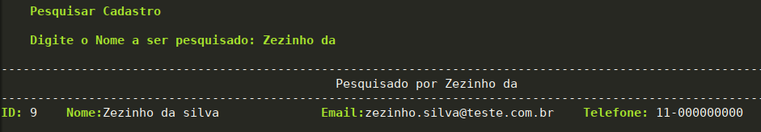

# Project Person registration

Esse projeto foi desenvolvido para mostra meus conhecimentos usando banco de dados em python.  


Foi usado nesse projeto banco de dados __mariaDB(v10.3)__, o modulo __mysql.connector__ para fazer a conexão com o banco de dados.  

This project was developed to show my knowledge using a python database.


In this project, the database __mariaDB (v10.3) __, the module __mysql.connector__, was used to make the connection to the database.

__Criado uma unica tabela__ / __created a single table__ 
```sql
create table cadastroUser
(
    nome varchar(100)not null,
    email varchar(100)not null,
    phone varchar(100)not null,
    idUser int primary key not null AUTO_INCREMENT 
);
```

### Menu principal / Main menu


__Cadatrar ->__ Cadastrar uma nova pessoa na base de dados. / Register a new person in the database. 
__Alterar ->__ Fazer modificação em usuário já cadastrado. /  Make changes to an already registered user. 
__Excluir ->__ Apagar da base de dados um usuário cadastrado. / Delete a registered user from the database. 
__Pesquisar ->__ Faz um pesquisa por um nome especifico e mostra na tela. / Do a search for a specific name and show it on the screen.
__Listar Todos ->__ Lista todos os usuário cadastrado.  / List all registered users.
__Sair ->__ Sai do programa. / exit the program


__Cadastro__ / __Register__ 
  


__Alterar__ / __Upadate__
  


__Pesquisar__ / __Search__
  

__Listar Todos__ / __List all__ 
  


